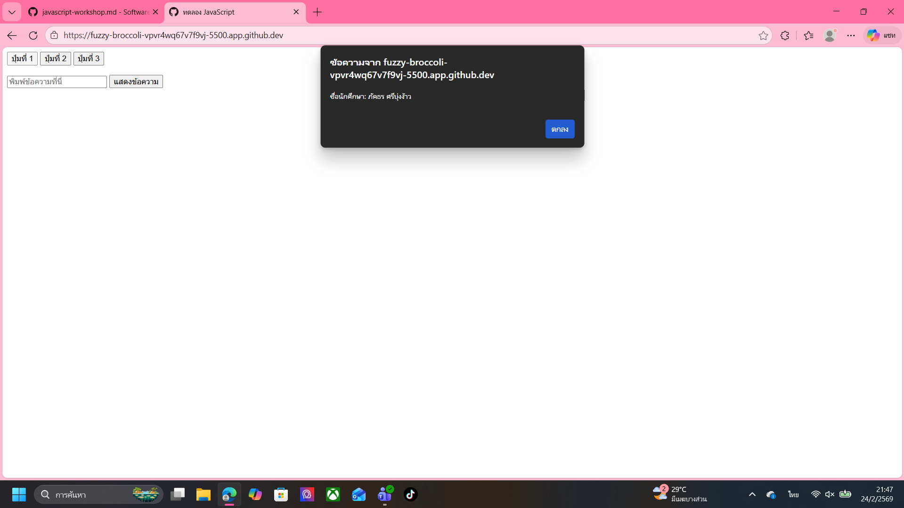
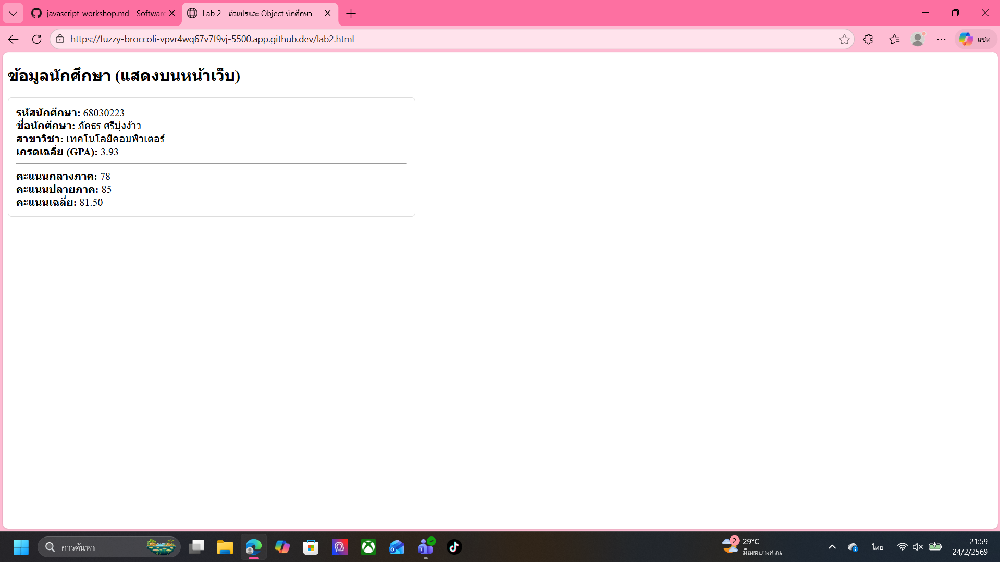
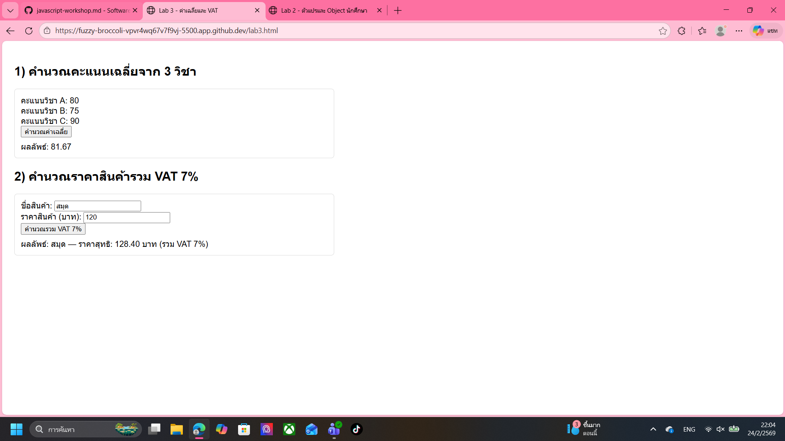
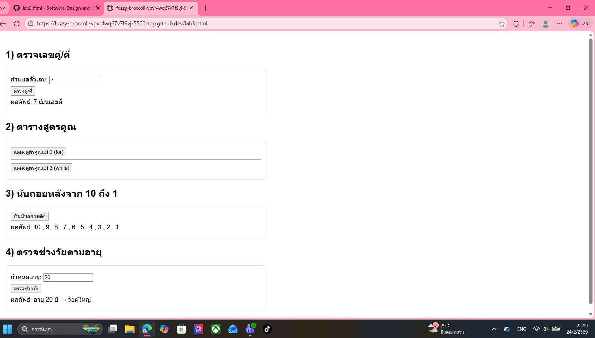
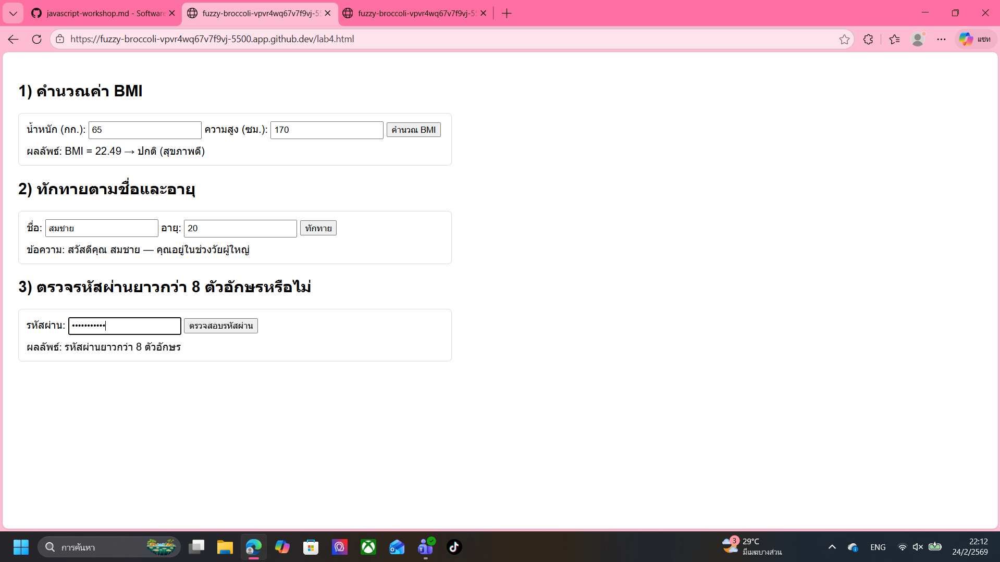
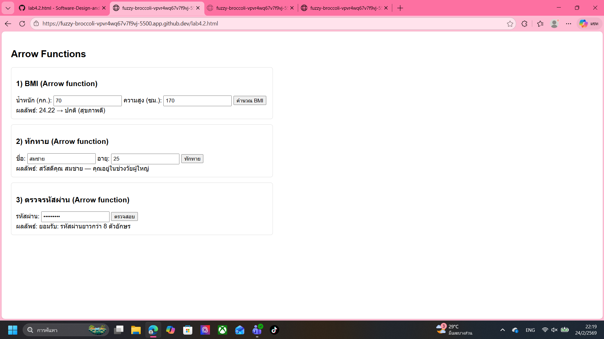
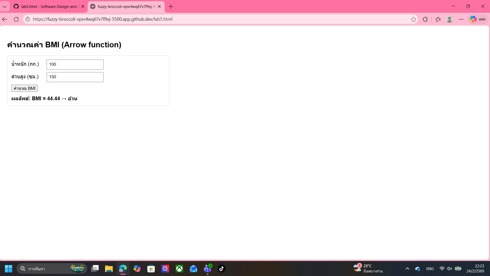
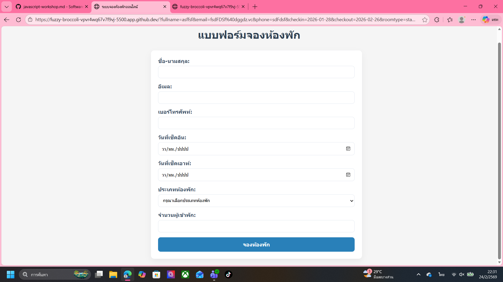
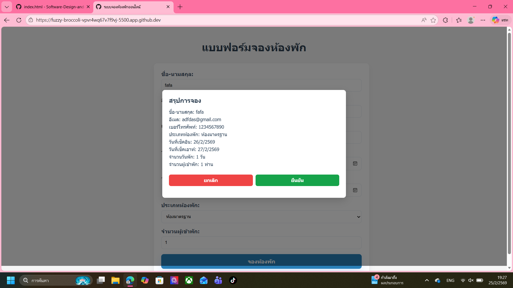

# การทดลอง พื้นฐาน JavaScript และการใช้งานร่วมกับ HTML/CSS
## การทดลองที่ 1 : ทำความรู้จักกับ JavaScript
###  การเพิ่ม JavaScript ลงในเว็บเพจ

JavaScript สามารถเพิ่มลงในเว็บเพจได้ 3 วิธี:

1. แบบ Inline: แทรก scipt ในแต่ละบรรทัดของ HTML Element
```html
<button onclick="alert('สวัสดี!')">คลิกที่นี่</button>
```

2. แบบ Internal Script: เขียน script ใน block   <script> </script>
```html
<script>
    alert('สวัสดี!');
</script>
```

3. แบบ External Script: เขียน script ในไฟล์แล้วเรียกใช้ใน HTML
   ไฟล์ script.js มีข้อมูลดังนี้
```javascript
    alert('สวัสดี!');
```
   ไฟล์ HTML มีการเรียกใช้ script ดังนี้
```html
<script src="script.js"></script>
```

### การทดลองที่ 1.1 : สร้างไฟล์ HTML และทดลองใช้ JavaScript ทั้ง 3 แบบ

สร้างไฟล์ `index.html`:
```html
<!DOCTYPE html>
<html lang="th">
<head>
    <meta charset="UTF-8">
    <title>ทดลอง JavaScript</title>
</head>
<body>
    <!-- Inline JavaScript -->
    <button onclick="alert('คลิกปุ่มที่ 1!')">ปุ่มที่ 1</button>

    <!-- ทดสอบ Internal JavaScript -->
    <button id="btn2">ปุ่มที่ 2</button>

    <!-- ทดสอบ External JavaScript -->
    <button id="btn3" onclick="hello3();">ปุ่มที่ 3</button>

    <!-- Internal JavaScript -->
    <script>
        document.getElementById('btn2').onclick = function() {
            alert('คลิกปุ่มที่ 2!');
        };
    </script>

    <!-- External JavaScript -->
  <!-- ต้องสร้างไฟล์ script.js มีโค้ดโปรแกรมในไฟล์ดังนี้
   function hello3(){
    alert('คลิกปุ่มที่ 3!');
    }
 -->
    <script src="script.js"></script>
</body>
</html>
```

### แบบฝึกปฏิบัติที่ 1: การใช้งาน JavaScript เบื้องต้น

1. สร้างหน้าเว็บที่มีปุ่ม 3 ปุ่ม:
   - ปุ่มที่ 1: ใช้ Inline JavaScript แสดงชื่อนักศึกษา
   - ปุ่มที่ 2: ใช้ Internal JavaScript แสดงวันที่ปัจจุบัน
   - ปุ่มที่ 3: ใช้ External JavaScript แสดงเวลาปัจจุบัน

2. เพิ่มกล่องข้อความและปุ่มสำหรับแสดงผล:
   - มีช่องกรอกข้อความ
   - มีปุ่มเมื่อคลิกแล้วจะแสดงข้อความที่กรอกในช่องข้อความ  (สามารถใช้ document.getElementById('id ของ textbox').value เพื่อดึงข้อมูลในช่อง)
### บันทึกผลการทดลอง 
```html
<!DOCTYPE html>
<html lang="th">
<head>
    <meta charset="UTF-8">
    <title>ทดลอง JavaScript</title>
</head>
<body>
    <!-- ปุ่มที่ 1: Inline JavaScript — แสดงชื่อนักศึกษา -->
    <button onclick="alert('ชื่อนักศึกษา: ภัคธร ศรีบุ่งง้าว')">ปุ่มที่ 1</button>

    <!-- ปุ่มที่ 2: Internal JavaScript — แสดงวันที่ปัจจุบัน -->
    <button id="btn2">ปุ่มที่ 2</button>

    <!-- ปุ่มที่ 3: External JavaScript — แสดงเวลาปัจจุบัน -->
    <button id="btn3" onclick="showCurrentTime();">ปุ่มที่ 3</button>

    <!-- กล่องข้อความและปุ่มสำหรับแสดงผล -->
    <div style="margin-top:16px;">
        <input type="text" id="inputText" placeholder="พิมพ์ข้อความที่นี่" />
        <button id="showTextBtn">แสดงข้อความ</button>
    </div>

    <div id="displayArea" style="margin-top:12px;color:green;font-weight:bold;"></div>

    <!-- Internal JavaScript -->
    <script>
        // ปุ่มที่ 2: แสดงวันที่ปัจจุบัน
        document.getElementById('btn2').onclick = function() {
            const today = new Date();
            // แสดงวันที่ในรูปแบบ locale
            alert('วันที่ปัจจุบัน: ' + today.toLocaleDateString());
        };

        // ปุ่มสำหรับแสดงข้อความจากกล่องข้อความ
        document.getElementById('showTextBtn').onclick = function() {
            const txt = document.getElementById('inputText').value;
            const out = document.getElementById('displayArea');
            if (txt.trim() === '') {
                out.textContent = 'คุณยังไม่ได้พิมพ์ข้อความ';
            } else {
                out.textContent = 'ข้อความ: ' + txt;
            }
        };

        // ฟังก์ชันแสดงเวลาปัจจุบัน (เดิมอยู่ใน script.js) — ตอนนี้เป็น Internal JS
        function showCurrentTime() {
            const now = new Date();
            alert('เวลาปัจจุบัน: ' + now.toLocaleTimeString());
        }
        window.showCurrentTime = showCurrentTime;
    </script>

</body>
</html>
```
**รูปผลการทดลอง**
![รูปผลการทดลองที่ 1]

## การทดลองที่ 2: พื้นฐาน JavaScript
### 2.1 การประกาศตัวแปรและชนิดข้อมูล

JavaScript มีวิธีการประกาศตัวแปร 3 แบบ:
- `var`: ประกาศตัวแปรแบบเดิม (legacy) - ไม่แนะนำให้ใช้ในโค้ดสมัยใหม่
- `let`: ประกาศตัวแปรที่สามารถเปลี่ยนแปลงค่าได้ - เหมาะสำหรับค่าที่ต้องการเปลี่ยนแปลงในภายหลัง
- `const`: ประกาศตัวแปรที่ไม่สามารถเปลี่ยนแปลงค่าได้ - เหมาะสำหรับค่าคงที่

ชนิดข้อมูลพื้นฐานใน JavaScript:
1. Number: ตัวเลขทั้งจำนวนเต็มและทศนิยม
2. String: ข้อความ ใช้เครื่องหมาย '' หรือ ""
3. Boolean: ค่าความจริง true/false
4. Undefined: ตัวแปรที่ยังไม่ได้กำหนดค่า
5. Null: ตัวแปรที่ไม่มีค่า (ต่างจาก undefined)
6. Array
7. Object
   
### ตัวอย่าง การประกาศตัวแปรแต่ละแบบ
```javascript
// ประกาศตัวแปรแบบ let - สามารถเปลี่ยนแปลงค่าได้ในภายหลัง
let name = "สมชาย";     // String เก็บข้อความ
let age = 25;           // Number เก็บตัวเลข
let isStudent = true;   // Boolean เก็บค่าจริง/เท็จ

// ประกาศตัวแปรแบบ const - ไม่สามารถเปลี่ยนแปลงค่าได้หลังจากประกาศ
const PI = 3.14;            // ค่าคงที่ทางคณิตศาสตร์
const DAYS_IN_WEEK = 7;     // ค่าคงที่ที่ไม่ควรเปลี่ยนแปลง

// การเปลี่ยนแปลงค่าตัวแปร
name = "สมหญิง";   // ทำได้เพราะประกาศด้วย let
age = 26;          // สามารถเปลี่ยนค่าได้
// PI = 3.15;      // Error! ไม่สามารถเปลี่ยนค่า const ได้

// ตัวอย่างการใช้งาน undefined และ null
let uninitializedVar;           // มีค่าเป็น undefined โดยอัตโนมัติ
let emptyValue = null;          // กำหนดค่า null อย่างชัดเจน

// ตัวอย่างการประกาศ Array
let fruits = ["แอปเปิ้ล", "กล้วย", "ส้ม"];

// ตัวอย่างการประกาศ Object
let person = {
    name: "สมชาย",
    age: 25,
    isStudent: true
};
```

### 📝 แบบทดสอบที่ 2.1: การทดลองประกาศตัวแปร
1. สร้างตัวแปรเก็บข้อมูล รหัสนักศึกษา ชื่อนักศึกษา คะแนนสอบกลางภาค, คะแนนสอบปลายภาค โดยเลือกใช้ let หรือ const 
2. สร้าง Object สำหรับเก็บข้อมูลนักศึกษา  ประกอบด้วยข้อมูล รหัสนักศึกษา, ชื่อ, สาขาวิชา, เกรดเฉลี่ย

### บันทึกผลการทดลอง 2.1
```html
<!DOCTYPE html>
<html lang="th">
<head>
	<meta charset="utf-8">
	<title>Lab 2 - ตัวแปรและ Object นักศึกษา</title>
</head>
<body>
	<h2>ข้อมูลนักศึกษา (แสดงบนหน้าเว็บ)</h2>

	<div id="studentCard" style="max-width:600px;border:1px solid #ddd;padding:12px;border-radius:6px;">
		<!-- ข้อมูลจะถูกเติมด้วย JavaScript -->
	</div>

	<script>
		// 1) ตัวแปรเก็บข้อมูลใช้ let หรือ const
		const studentId = '68030223'; // รหัสนักศึกษา (ไม่เปลี่ยนแปลง)
		let studentName = 'ภัคธร ศรีบุ่งง้าว'; // ชื่อนักศึกษา (สามารถเปลี่ยนได้)
		let midtermScore = 78; // คะแนนสอบกลางภาค
		let finalScore = 85;   // คะแนนสอบปลายภาค

		// 2) สร้าง Object สำหรับเก็บข้อมูลนักศึกษา
		const student = {
			id: studentId,
			name: studentName,
			major: 'เทคโนโลยีคอมพิวเตอร์',
			gpa: 3.93
		};

		// คำนวณคะแนนเฉลี่ย
		const averageScore = ((midtermScore + finalScore) / 2).toFixed(2);

		// แสดงผลบนหน้าเว็บ
		const card = document.getElementById('studentCard');
		card.innerHTML = `
			<div><strong>รหัสนักศึกษา:</strong> ${student.id}</div>
			<div><strong>ชื่อนักศึกษา:</strong> ${student.name}</div>
			<div><strong>สาขาวิชา:</strong> ${student.major}</div>
			<div><strong>เกรดเฉลี่ย (GPA):</strong> ${student.gpa}</div>
			<hr />
			<div><strong>คะแนนกลางภาค:</strong> ${midtermScore}</div>
			<div><strong>คะแนนปลายภาค:</strong> ${finalScore}</div>
			<div><strong>คะแนนเฉลี่ย:</strong> ${averageScore}</div>
		`;

		// ยังคงแสดงใน console เพื่อการดีบัก
		console.log('student object:', student);
	</script>
</body>
</html>

```
**รูปผลการทดลอง**
![รูปผลการทดลองที่ 2.1]


### 2.2 การดำเนินการทางคณิตศาสตร์

JavaScript มีตัวดำเนินการทางคณิตศาสตร์พื้นฐานดังนี้:
- `+` การบวก
- `-` การลบ
- `*` การคูณ
- `/` การหาร
- `%` การหารเอาเศษ (modulo)
- `**` การยกกำลัง (exponentiation)
- `++` การเพิ่มค่าทีละ 1 (increment)
- `--` การลดค่าทีละ 1 (decrement)

### แบบฝึกหัด 2.2: ทดลองใช้ตัวดำเนินการทางคณิตศาสตร์
```javascript
// กำหนดค่าตัวแปรเริ่มต้น
let x = 10;
let y = 5;

// การดำเนินการพื้นฐาน
let sum = x + y;      // บวก: 10 + 5 = 15
let diff = x - y;     // ลบ: 10 - 5 = 5
let product = x * y;  // คูณ: 10 * 5 = 50
let quotient = x / y; // หาร: 10 / 5 = 2
let remainder = x % y; // หารเอาเศษ: 10 % 5 = 0 (หาร 5 ลงตัว)

// การเพิ่ม/ลดค่าทีละ 1
let counter = 1;
counter++;            // เพิ่มค่าทีละ 1: counter = 2
counter--;            // ลดค่าทีละ 1: counter = 1

// การยกกำลัง
let squared = x ** 2;  // 10 ยกกำลัง 2 = 100
let cubed = x ** 3;    // 10 ยกกำลัง 3 = 1000

// การใช้ตัวดำเนินการร่วมกับการกำหนดค่า
let number = 5;
number += 3;          // เท่ากับ number = number + 3
number -= 2;          // เท่ากับ number = number - 2
number *= 4;          // เท่ากับ number = number * 4
number /= 2;          // เท่ากับ number = number / 2

```

### 📝 แบบทดสอบที่ 2.2: การคำนวณพื้นฐาน
1. เขียนโปรแกรม กำหนดคะแนน  3 วิชา แล้วหาค่าคะแนนเฉลี่ย แล้วแสดงผลการคำนวณ
2. เขียนโปรแกรม กำหนดชื่อสินค้า ราคาสินค้า คำนวณราคาสินค้าที่รวม VAT 7% แล้วแสดงผลการคำนวณ

### บันทึกผลการทดลอง 2.2
```html
<!DOCTYPE html>
<html lang="th">
<head>
  <meta charset="utf-8">
  <title>Lab 3 - ค่าเฉลี่ยและ VAT</title>
  <style>body{font-family:Arial;padding:16px} .box{max-width:600px;border:1px solid #ddd;padding:12px;border-radius:6px;margin-bottom:12px}</style>
</head>
<body>
  <h2>1) คำนวณคะแนนเฉลี่ยจาก 3 วิชา</h2>
  <div class="box" id="avgBox">
    <div>คะแนนวิชา A: <span id="scoreA">80</span></div>
    <div>คะแนนวิชา B: <span id="scoreB">75</span></div>
    <div>คะแนนวิชา C: <span id="scoreC">90</span></div>
    <button id="calcAvg">คำนวณค่าเฉลี่ย</button>
    <div style="margin-top:8px">ผลลัพธ์: <span id="avgResult">-</span></div>
  </div>

  <h2>2) คำนวณราคาสินค้ารวม VAT 7%</h2>
  <div class="box" id="vatBox">
    <div>ชื่อสินค้า: <input id="prodName" value="สมุด" /></div>
    <div>ราคาสินค้า (บาท): <input id="prodPrice" value="120" /></div>
    <button id="calcVat">คำนวณรวม VAT 7%</button>
    <div style="margin-top:8px">ผลลัพธ์: <span id="vatResult">-</span></div>
  </div>

  <script>
    // 1) คำนวณค่าเฉลี่ยจาก 3 วิชา
    const scoreA = 80;
    const scoreB = 75;
    const scoreC = 90;

    document.getElementById('scoreA').textContent = scoreA;
    document.getElementById('scoreB').textContent = scoreB;
    document.getElementById('scoreC').textContent = scoreC;

    document.getElementById('calcAvg').onclick = function() {
      const avg = ((scoreA + scoreB + scoreC) / 3).toFixed(2);
      document.getElementById('avgResult').textContent = avg;
      console.log('Average:', avg);
    };

    // 2) คำนวณราคาสินค้ารวม VAT 7%
    document.getElementById('calcVat').onclick = function() {
      const name = document.getElementById('prodName').value;
      const price = parseFloat(document.getElementById('prodPrice').value) || 0;
      const vatRate = 0.07;
      const total = (price * (1 + vatRate)).toFixed(2);
      document.getElementById('vatResult').textContent = `${name} — ราคาสุทธิ: ${total} บาท (รวม VAT 7%)`;
      console.log('Product:', name, 'Price:', price, 'Total:', total);
    };
  </script>
</body>
</html>

```
**รูปผลการทดลอง**
![รูปผลการทดลองที่ 2.2]images/

### 2.3 การควบคุมการทำงาน

JavaScript มีโครงสร้างควบคุมการทำงานหลักๆ ดังนี้:

1. เงื่อนไข (Conditionals):
   - `if`: ตรวจสอบเงื่อนไขเดียว
   - `if...else`: ตรวจสอบเงื่อนไขและมีทางเลือก
   - `if...else if...else`: ตรวจสอบหลายเงื่อนไข
   - `switch`: เลือกทำงานตามค่าที่กำหนด

2. การวนซ้ำ (Loops):
   - `for`: วนซ้ำตามจำนวนรอบที่กำหนด
   - `while`: วนซ้ำตราบใดที่เงื่อนไขเป็นจริง
   - `do...while`: ทำงานอย่างน้อย 1 ครั้ง แล้ววนซ้ำตามเงื่อนไข
   - `for...of`: วนซ้ำสำหรับข้อมูลแบบ iterable
   - `for...in`: วนซ้ำสำหรับ properties ใน object


```javascript
// 1. การใช้ if-else
let score = 75;

// ตรวจสอบเงื่อนไขตามลำดับ
if (score >= 80) {         // ถ้าคะแนน >= 80
    console.log("เกรด A");
} else if (score >= 70) {  // ถ้าคะแนน >= 70 แต่ < 80
    console.log("เกรด B");
} else {                   // ถ้าไม่ตรงเงื่อนไขใดเลย
    console.log("เกรด C");
}

// 2. การใช้ switch
let day = 1;
switch (day) {
    case 1:
        console.log("วันจันทร์");
        break;              // break เพื่อออกจาก switch
    case 2:
        console.log("วันอังคาร");
        break;
    default:               // ค่าเริ่มต้นถ้าไม่ตรงกับ case ใดๆ
        console.log("วันอื่นๆ");
}

// 3. การใช้ for loop
// วนซ้ำ 5 รอบ: เริ่มที่ 1, ทำจนถึง 5, เพิ่มค่าทีละ 1
for (let i = 1; i <= 5; i++) {
    console.log("รอบที่", i);
}

// 4. การใช้ while loop
// วนซ้ำตราบใดที่เงื่อนไขเป็นจริง
let count = 1;
while (count <= 3) {      // ทำซ้ำตราบใดที่ count <= 3
    console.log("นับ:", count);
    count++;              // เพิ่มค่า count ทีละ 1
}

// 5. การใช้ do...while loop
// ทำงานอย่างน้อย 1 ครั้ง แล้วค่อยตรวจสอบเงื่อนไข
let num = 1;
do {
    console.log("ตัวเลข:", num);
    num++;
} while (num <= 3);

// 6. การใช้ for...of loop กับ array
let fruits = ['แอปเปิ้ล', 'กล้วย', 'ส้ม'];
for (let fruit of fruits) {
    console.log("ผลไม้:", fruit);
}

// 7. การใช้ for...in loop กับ object
let person = {
    name: 'สมชาย',
    age: 25,
    job: 'โปรแกรมเมอร์'
};
for (let key in person) {
    console.log(key + ":", person[key]);
}

// 8. การใช้เงื่อนไขซ้อน (Nested Conditions)
let age = 18;
let hasPermission = true;

if (age >= 18) {
    if (hasPermission) {
        console.log("สามารถเข้าใช้งานได้");
    } else {
        console.log("ต้องได้รับอนุญาตก่อน");
    }
} else {
    console.log("อายุไม่ถึงเกณฑ์");
}

// 9. การใช้ตัวดำเนินการลอจิคัล (Logical Operators)
let isStudent = true;
let isMember = false;

if (isStudent && isMember) {           // AND (&&)
    console.log("เป็นทั้งนักเรียนและสมาชิก");
} else if (isStudent || isMember) {    // OR (||)
    console.log("เป็นอย่างใดอย่างหนึ่ง");
} else {
    console.log("ไม่เป็นทั้งสองอย่าง");
}

// 10. การใช้ break และ continue
for (let i = 1; i <= 5; i++) {
    if (i === 3) {
        continue;    // ข้ามการทำงานที่เหลือในรอบนี้
    }
    if (i === 4) {
        break;       // ออกจาก loop ทันที
    }
    console.log("ตัวเลข:", i);
}
```


### 📝 แบบทดสอบที่ 2.3: การควบคุมการทำงาน
1. กำหนดตัวเลข และตรวจสอบว่าตัวเลขที่กำหนดเป็นเลขคู่หรือเลขคี่
2. สร้าง loop แบบ for แสดงตารางสูตรคูณ แม่ 2 และ loop แบบ while แสดงสูตรคูณ แม่ 3
3. เขียนโปรแกรมนับถอยหลังจาก 10 ถึง 1
4. เขียนโปรแกรมกำหนดอายุ และตรวจสอบช่วงวัยตามอายุที่กำหนด (กำหนดอายุแต่ละช่วงวัย วัยเด็ก วัยรุ่น วัยผู้ใหญ่)

### บันทึกผลการทดลอง 2.3
```html
<!DOCTYPE html>
<html lang="th">
<head>
  <meta charset="utf-8">
  <style>
    body{font-family:Arial,Helvetica,sans-serif;padding:16px}
    .box{max-width:640px;border:1px solid #ddd;padding:12px;border-radius:6px;margin-bottom:14px}
    .row{margin:6px 0}
    input[type="number"]{width:120px}
  </style>
</head>
<body>
  <h2>1) ตรวจเลขคู่/คี่</h2>
  <div class="box">
    <div class="row">กำหนดตัวเลข: <input id="parityInput" type="number" value="7" /></div>
    <button id="parityBtn">ตรวจคู่/คี่</button>
    <div class="row">ผลลัพธ์: <span id="parityResult">-</span></div>
  </div>

  <h2>2) ตารางสูตรคูณ</h2>
  <div class="box">
    <div class="row"><button id="mul2Btn">แสดงสูตรคูณแม่ 2 (for)</button></div>
    <div id="mul2Area" class="row"></div>
    <hr />
    <div class="row"><button id="mul3Btn">แสดงสูตรคูณแม่ 3 (while)</button></div>
    <div id="mul3Area" class="row"></div>
  </div>

  <h2>3) นับถอยหลังจาก 10 ถึง 1</h2>
  <div class="box">
    <button id="countdownBtn">เริ่มนับถอยหลัง</button>
    <div class="row">ผลลัพธ์: <span id="countdownArea">-</span></div>
  </div>

  <h2>4) ตรวจช่วงวัยตามอายุ</h2>
  <div class="box">
    <div class="row">กำหนดอายุ: <input id="ageInput" type="number" value="20" /></div>
    <button id="ageBtn">ตรวจช่วงวัย</button>
    <div class="row">ผลลัพธ์: <span id="ageResult">-</span></div>
  </div>

  <script>
    // 1) ตรวจเลขคู่/คี่
    document.getElementById('parityBtn').onclick = function() {
      const v = parseInt(document.getElementById('parityInput').value, 10);
      const out = document.getElementById('parityResult');
      if (Number.isNaN(v)) { out.textContent = 'ค่าที่ใส่ไม่ใช่ตัวเลข'; return; }
      out.textContent = (v % 2 === 0) ? `${v} เป็นเลขคู่` : `${v} เป็นเลขคี่`;
    };

    // 2) ตารางสูตรคูณ แม่ 2 (for)
    document.getElementById('mul2Btn').onclick = function() {
      const area = document.getElementById('mul2Area');
      let html = '<pre>';
      for (let i = 1; i <= 10; i++) {
        html += `2 x ${i} = ${2 * i}\n`;
      }
      html += '</pre>';
      area.innerHTML = html;
    };

    // 2b) ตารางสูตรคูณ แม่ 3 (while)
    document.getElementById('mul3Btn').onclick = function() {
      const area = document.getElementById('mul3Area');
      let i = 1;
      let html = '<pre>';
      while (i <= 10) {
        html += `3 x ${i} = ${3 * i}\n`;
        i++;
      }
      html += '</pre>';
      area.innerHTML = html;
    };

    // 3) นับถอยหลังจาก 10 ถึง 1
    document.getElementById('countdownBtn').onclick = function() {
      const out = document.getElementById('countdownArea');
      const parts = [];
      for (let i = 10; i >= 1; i--) parts.push(i);
      out.textContent = parts.join(' , ');
    };

    // 4) ตรวจช่วงวัยตามอายุ
    document.getElementById('ageBtn').onclick = function() {
      const age = parseInt(document.getElementById('ageInput').value, 10);
      const out = document.getElementById('ageResult');
      if (Number.isNaN(age) || age < 0) { out.textContent = 'กรุณาใส่อายุตัวเลขบวก'; return; }
      let stage = '';
      if (age <= 12) stage = 'วัยเด็ก';
      else if (age <= 19) stage = 'วัยรุ่น';
      else stage = 'วัยผู้ใหญ่';
      out.textContent = `อายุ ${age} ปี → ${stage}`;
    };
  </script>
</body>
</html>

```
**รูปผลการทดลอง**
![รูปผลการทดลองที่ 2.3]

### 2.4 Functions และ Arrow Functions

Functions คือกลุ่มคำสั่งที่สามารถนำมาใช้ซ้ำได้ ใน JavaScript มีวิธีการเขียน function 2 แบบหลักๆ:

1. Function แบบปกติ (Regular Functions):
   - ใช้คำสั่ง `function` ในการประกาศ
   - สามารถมีหรือไม่มีพารามิเตอร์ก็ได้
   - สามารถ return ค่ากลับหรือไม่ก็ได้
   - มี `this` context ของตัวเอง

2. Arrow Functions:
   - เป็นวิธีเขียนแบบสั้นที่มาใน ES6
   - ไม่มี `this` context ของตัวเอง
   - เหมาะสำหรับ function สั้นๆ
   - มักใช้ใน callback functions

#### ตัวอย่างการสร้างและเรียกใช้ Function 

```javascript
// 1. Function พื้นฐาน - ไม่มีพารามิเตอร์และไม่ return ค่า
function sayHello() {
    console.log("สวัสดี!");
}
sayHello();  // เรียกใช้ function: แสดง "สวัสดี!"

// 2. Function ที่รับพารามิเตอร์
function greet(name) {
    console.log("สวัสดี " + name);
}
greet("สมชาย");  // แสดง: "สวัสดี สมชาย"

// 3. Function ที่ return ค่า
function add(a, b) {
    return a + b;  // ส่งค่าผลบวกกลับ
}
let sum = add(5, 3);  // sum = 8

// 4. Function ที่มีค่าเริ่มต้นของพารามิเตอร์
function greetWithTitle(name, title = "คุณ") {
    console.log("สวัสดี " + title + " " + name);
}
greetWithTitle("สมชาย");          // แสดง: "สวัสดี คุณ สมชาย"
greetWithTitle("สมชาย", "ดร.");   // แสดง: "สวัสดี ดร. สมชาย"

// 5. Function ที่รับหลายพารามิเตอร์ (Rest Parameters)
function sum(...numbers) {
    let total = 0;
    for (let num of numbers) {
        total += num;
    }
    return total;
}
console.log(sum(1, 2, 3, 4));  // แสดง: 10

// 6. Function ที่ return หลายค่าโดยใช้ Object
function getPersonInfo() {
    return {
        name: "สมชาย",
        age: 25,
        job: "โปรแกรมเมอร์"
    };
}
let person = getPersonInfo();
console.log(person.name);  // แสดง: "สมชาย"

// 7. Function ที่เป็น Method ใน Object
let calculator = {
    add: function(a, b) {
        return a + b;
    },
    subtract: function(a, b) {
        return a - b;
    }
};
console.log(calculator.add(5, 3));      // แสดง: 8
console.log(calculator.subtract(5, 3));  // แสดง: 2

// 8. Nested Function (Function ซ้อน Function)
function outer(x) {
    function inner(y) {
        return x + y;  // inner function สามารถเข้าถึงตัวแปรของ outer function
    }
    return inner;
}
let addFive = outer(5);
console.log(addFive(3));  // แสดง: 8

// 9. Callback Function
function process(callback) {
    console.log("กำลังประมวลผล...");
    callback();  // เรียกใช้ function ที่ส่งเข้ามา
}
process(function() {
    console.log("เสร็จสิ้น!");
});

// 10. Immediately Invoked Function Expression (IIFE)
(function() {
    console.log("Function นี้ทำงานทันทีที่ถูกประกาศ");
})();
```


### 📝 แบบทดสอบที่ 2.4.1: Functions
1. สร้าง function คำนวณค่า BMI (ดัชนีมวลกาย) จากน้ำหนักและส่วนสูง
2. สร้าง function ที่รับชื่อและอายุ แล้วแสดงข้อความทักทายที่เหมาะสมกับอายุ
3. เขียน function ตรวจสอบรหัสผ่านว่ามีความยาวมากกว่า 8 ตัวอักษรหรือไม่

### บันทึกผลการทดลอง 2.4.1
```html
<!DOCTYPE html>
<html lang="th">
<head>
  <meta charset="utf-8">
  <style>body{font-family:Arial;padding:16px} .box{max-width:640px;border:1px solid #ddd;padding:12px;border-radius:6px;margin-bottom:14px} input{padding:4px}</style>
</head>
<body>
  <h2>1) คำนวณค่า BMI</h2>
  <div class="box">
    น้ำหนัก (กก.): <input id="weight" type="number" value="65" />
    ความสูง (ซม.): <input id="height" type="number" value="170" />
    <button id="bmiBtn">คำนวณ BMI</button>
    <div style="margin-top:8px">ผลลัพธ์: <span id="bmiResult">-</span></div>
  </div>

  <h2>2) ทักทายตามชื่อและอายุ</h2>
  <div class="box">
    ชื่อ: <input id="gName" value="สมชาย" />
    อายุ: <input id="gAge" type="number" value="20" />
    <button id="greetBtn">ทักทาย</button>
    <div style="margin-top:8px">ข้อความ: <span id="greetResult">-</span></div>
  </div>

  <h2>3) ตรวจรหัสผ่านยาวกว่า 8 ตัวอักษรหรือไม่</h2>
  <div class="box">
    รหัสผ่าน: <input id="pwd" type="password" value="password123" />
    <button id="pwdBtn">ตรวจสอบรหัสผ่าน</button>
    <div style="margin-top:8px">ผลลัพธ์: <span id="pwdResult">-</span></div>
  </div>

  <script>
    // 1) function คำนวณค่า BMI
    function calculateBMI(weightKg, heightCm) {
      const h = heightCm / 100;
      if (h <= 0) return null;
      const bmi = weightKg / (h * h);
      return parseFloat(bmi.toFixed(2));
    }

    function bmiCategory(bmi) {
      if (bmi === null) return 'ข้อมูลความสูงไม่ถูกต้อง';
      if (bmi < 18.5) return 'น้ำหนักน้อย / ผอม';
      if (bmi < 25) return 'ปกติ (สุขภาพดี)';
      if (bmi < 30) return 'น้ำหนักเกิน';
      return 'อ้วน';
    }

    document.getElementById('bmiBtn').onclick = function() {
      const w = parseFloat(document.getElementById('weight').value) || 0;
      const h = parseFloat(document.getElementById('height').value) || 0;
      const bmi = calculateBMI(w, h);
      const out = document.getElementById('bmiResult');
      if (bmi === null) out.textContent = 'กรุณาใส่ความสูงที่ถูกต้อง';
      else out.textContent = `BMI = ${bmi} → ${bmiCategory(bmi)}`;
    };

    // 2) function ทักทายตามชื่อและอายุ
    function greetByNameAge(name, age) {
      if (!name) name = 'ผู้ใช้';
      if (Number.isNaN(age) || age < 0) return `สวัสดี ${name} (อายุไม่ถูกต้อง)`;
      let stage = '';
      if (age <= 12) stage = 'วัยเด็ก';
      else if (age <= 19) stage = 'วัยรุ่น';
      else if (age <= 59) stage = 'วัยผู้ใหญ่';
      else stage = 'วัยสูงอายุ';
      return `สวัสดีคุณ ${name} — คุณอยู่ในช่วง${stage}`;
    }

    document.getElementById('greetBtn').onclick = function() {
      const name = document.getElementById('gName').value.trim();
      const age = parseInt(document.getElementById('gAge').value, 10);
      document.getElementById('greetResult').textContent = greetByNameAge(name, age);
    };

    // 3) function ตรวจรหัสผ่านความยาว > 8
    function isPasswordLong(password) {
      if (typeof password !== 'string') return false;
      return password.length > 8;
    }

    document.getElementById('pwdBtn').onclick = function() {
      const p = document.getElementById('pwd').value || '';
      const ok = isPasswordLong(p);
      document.getElementById('pwdResult').textContent = ok ? 'รหัสผ่านยาวกว่า 8 ตัวอักษร' : 'รหัสผ่านต้องยาวมากกว่า 8 ตัวอักษร';
    };
  </script>
</body>
</html>

```
**รูปผลการทดลอง**
![รูปผลการทดลองที่ 2.4.1]


#### 2.4.2 Arrow Function
Arrow Function เป็นวิธีการเขียน function แบบสั้นๆ ที่มาพร้อมกับ JavaScript เวอร์ชัน ES6

### ตัวอย่างการใช้ Arrow Function
```javascript
// Arrow Function แบบพื้นฐาน
const greet = (name) => {
    return "สวัสดี " + name;
};

// Arrow Function แบบย่อ (ถ้ามีคำสั่งเดียว)
const greetShort = name => "สวัสดี " + name;

// Arrow Function ที่มีหลายพารามิเตอร์
const multiply = (a, b) => a * b;

// Arrow Function ที่ไม่มีพารามิเตอร์
const getRandomNumber = () => Math.random();

// ตัวอย่างการใช้ Arrow Function กับ Array
const numbers = [1, 2, 3, 4, 5];

// การใช้ map กับ Arrow Function
const doubled = numbers.map(num => num * 2);
console.log("เลขคูณ 2:", doubled); // [2, 4, 6, 8, 10]

// การใช้ filter กับ Arrow Function
const evenNumbers = numbers.filter(num => num % 2 === 0);
console.log("เลขคู่:", evenNumbers); // [2, 4]
```
### แบบทดสอบ 2.4.2 เขียนฟังก์ชันต่อไปนี้ในรูปแบบ Arrow function
1. สร้าง function คำนวณค่า BMI (ดัชนีมวลกาย) จากน้ำหนักและส่วนสูง
2. สร้าง function ที่รับชื่อและอายุ แล้วแสดงข้อความทักทายที่เหมาะสมกับอายุ
3. เขียน function ตรวจสอบรหัสผ่านว่ามีความยาวมากกว่า 8 ตัวอักษรหรือไม่

### บันทึกผลการทดลอง 2.4.2
```html
<!DOCTYPE html>
<html lang="th">
<head>
	<meta charset="utf-8">
	<style>body{font-family:Arial;padding:16px} .box{max-width:640px;border:1px solid #ddd;padding:12px;border-radius:6px;margin-bottom:14px} input{padding:4px}</style>
</head>
<body>
	<h2>Arrow Functions</h2>

	<div class="box">
		<h3>1) BMI (Arrow function)</h3>
		น้ำหนัก (กก.): <input id="w" type="number" value="70" />
		ความสูง (ซม.): <input id="h" type="number" value="170" />
		<button id="bmiBtn">คำนวณ BMI</button>
		<div>ผลลัพธ์: <span id="bmiOut">-</span></div>
	</div>

	<div class="box">
		<h3>2) ทักทาย (Arrow function)</h3>
		ชื่อ: <input id="nameInput" value="สมชาย" />
		อายุ: <input id="ageInput" type="number" value="25" />
		<button id="greetBtn">ทักทาย</button>
		<div>ผลลัพธ์: <span id="greetOut">-</span></div>
	</div>

	<div class="box">
		<h3>3) ตรวจรหัสผ่าน (Arrow function)</h3>
		รหัสผ่าน: <input id="pwdInput" type="password" value="pass12345" />
		<button id="pwdBtn">ตรวจสอบ</button>
		<div>ผลลัพธ์: <span id="pwdOut">-</span></div>
	</div>

	<script>
		// 1) BMI as arrow function: returns BMI number (2 decimals) or null
		const calculateBMI = (weightKg, heightCm) => {
			const h = heightCm / 100;
			if (!h || h <= 0) return null;
			return parseFloat((weightKg / (h * h)).toFixed(2));
		};

		const bmiCategory = bmi => {
			if (bmi === null) return 'ข้อมูลความสูงไม่ถูกต้อง';
			if (bmi < 18.5) return 'น้ำหนักน้อย / ผอม';
			if (bmi < 25) return 'ปกติ (สุขภาพดี)';
			if (bmi < 30) return 'น้ำหนักเกิน';
			return 'อ้วน';
		};

		document.getElementById('bmiBtn').onclick = () => {
			const w = parseFloat(document.getElementById('w').value) || 0;
			const h = parseFloat(document.getElementById('h').value) || 0;
			const bmi = calculateBMI(w, h);
			document.getElementById('bmiOut').textContent = bmi === null ? 'ความสูงไม่ถูกต้อง' : `${bmi} → ${bmiCategory(bmi)}`;
		};

		// 2) Greeting as arrow function
		const greetByNameAge = (name, age) => {
			const n = (name || 'ผู้ใช้').trim();
			if (Number.isNaN(age) || age < 0) return `สวัสดี ${n} (อายุไม่ถูกต้อง)`;
			let stage = '';
			if (age <= 12) stage = 'วัยเด็ก';
			else if (age <= 19) stage = 'วัยรุ่น';
			else if (age <= 59) stage = 'วัยผู้ใหญ่';
			else stage = 'วัยสูงอายุ';
			return `สวัสดีคุณ ${n} — คุณอยู่ในช่วง${stage}`;
		};

		document.getElementById('greetBtn').onclick = () => {
			const n = document.getElementById('nameInput').value;
			const a = parseInt(document.getElementById('ageInput').value, 10);
			document.getElementById('greetOut').textContent = greetByNameAge(n, a);
		};

		// 3) Password length check as arrow function
		const isPasswordLong = pwd => (typeof pwd === 'string' && pwd.length > 8);

		document.getElementById('pwdBtn').onclick = () => {
			const p = document.getElementById('pwdInput').value || '';
			const ok = isPasswordLong(p);
			document.getElementById('pwdOut').textContent = ok ? 'ยอมรับ: รหัสผ่านยาวกว่า 8 ตัวอักษร' : 'ปฏิเสธ: ต้องยาวกว่า 8 ตัวอักษร';
		};
	</script>
</body>
</html>

```
**รูปผลการทดลอง**
![รูปผลการทดลองที่ 2.4.2]


## การทดลองที่ 3 : การใช้ JavaScript กับ HTML และ CSS
### การทดลองที่ 3.1 การสร้างปุ่มและจัดการ Event ด้วย JavaScript
### ตัวอย่างที่ 1 
```html
<!DOCTYPE html>
<html>
<head>
    <title>Event Handling</title>
</head>
<body>
    <button onclick="showMessage()">คลิกที่นี่</button>
    
    <script>
    function showMessage() {
        alert("สวัสดีครับ/ค่ะ!");
    }
    </script>
</body>
</html>
```
### ตัวอย่างที่ 2
```html
<!DOCTYPE html>
<html>
<head>
    <title>Event Handling</title>
</head>
<body>
    Enter name<input type="text" id="name">
    <button onclick="showMessage(document.getElementById('name').value)">คลิกที่นี่</button>
    
    <script>
    function showMessage(name) {
        alert("สวัสดีครับ/ค่ะ คุณ :",name);
    }
    </script>
</body>
</html>
```
### ตัวอย่างที่ 3 
```html
<!DOCTYPE html>
<html>
<head>
    <title>Event Handling</title>
</head>
<body>
    Enter name<input type="text" id="name">
    <p id="output_value"></p>
    <button onclick="showMessage(document.getElementById('name').value)">คลิกที่นี่</button>
    
    <script>
    function showMessage(name) {
        document.getElementById('output_value').innerHTML='Hello' + name;
    }
    </script>
</body>
</html>
```

### แบบทดสอบ 3.1 
1. เขียนเว็บ รับค่าน้ำหนักและส่วนสูง ทำการ คำนวณค่า BMI (ดัชนีมวลกาย) แล้วแสดงผลว่า อ้วน, ผอม หรือ สมส่วน โดยเขียนฟังก์ชันแบบ Arrow function

### บันทึกผลการทดลอง 3.1
```html
<!DOCTYPE html>
<html lang="th">
<head>
  <meta charset="utf-8">

  <style>
    body{font-family:Arial,Helvetica,sans-serif;padding:16px}
    .card{max-width:480px;border:1px solid #ddd;padding:12px;border-radius:6px}
    label{display:inline-block;width:110px}
    input{padding:6px;margin-bottom:8px}
    .result{margin-top:10px;font-weight:bold}
  </style>
</head>
<body>
  <h2>คำนวณค่า BMI (Arrow function)</h2>
  <div class="card">
    <div><label>น้ำหนัก (กก.)</label><input id="weight" type="number" value="65" /></div>
    <div><label>ส่วนสูง (ซม.)</label><input id="height" type="number" value="170" /></div>
    <button id="calc">คำนวณ BMI</button>
    <div class="result" id="output">ผลลัพธ์: -</div>
  </div>

  <script>
    // Arrow function for BMI calculation
    const calculateBMI = (weightKg, heightCm) => {
      const h = heightCm / 100;
      if (!h || h <= 0) return null;
      return weightKg / (h * h);
    };

    // Arrow function for category: ผอม / สมส่วน / อ้วน
    const bmiCategory = bmi => {
      if (bmi === null) return 'ข้อมูลไม่ถูกต้อง';
      if (bmi < 18.5) return 'ผอม';
      if (bmi < 25) return 'สมส่วน';
      return 'อ้วน';
    };

    document.getElementById('calc').addEventListener('click', () => {
      const w = parseFloat(document.getElementById('weight').value) || 0;
      const h = parseFloat(document.getElementById('height').value) || 0;
      const bmi = calculateBMI(w, h);
      const out = document.getElementById('output');
      if (bmi === null) {
        out.textContent = 'ผลลัพธ์: กรุณาใส่ความสูงที่ถูกต้อง';
        return;
      }
      const bmiRounded = bmi.toFixed(2);
      out.textContent = `ผลลัพธ์: BMI = ${bmiRounded} → ${bmiCategory(bmi)}`;
    });
  </script>
</body>
</html>

```
**รูปผลการทดลอง**
![รูปผลการทดลองที่ 3.1]

## การทดลองที่ 3.2 : การสร้างฟอร์มสำหรับจองห้องพัก
การสร้างฟอร์มลงทะเบียนเพื่อรวบรวมข้อมูลที่จำเป็นสำหรับการจองห้องพัก

### ขั้นตอนที่ 3.2.1: สร้างโครงสร้าง HTML พื้นฐาน

สร้างไฟล์ `index.html` และใส่โค้ดต่อไปนี้:

```html
<!DOCTYPE html>
<html lang="th">
<head>
    <meta charset="UTF-8">
    <meta name="viewport" content="width=device-width, initial-scale=1.0">
    <title>ระบบจองห้องพักออนไลน์</title>
</head>
<body>
    <h1>แบบฟอร์มจองห้องพัก</h1>
    
    <form id="bookingForm">
        <div>
            <label for="fullname">ชื่อ-นามสกุล:</label>
            <input type="text" id="fullname" name="fullname" required>
        </div>

        <div>
            <label for="email">อีเมล:</label>
            <input type="email" id="email" name="email" required>
        </div>

        <div>
            <label for="phone">เบอร์โทรศัพท์:</label>
            <input type="tel" id="phone" name="phone" required>
        </div>

        <div>
            <label for="checkin">วันที่เช็คอิน:</label>
            <input type="date" id="checkin" name="checkin" required>
        </div>

        <div>
            <label for="checkout">วันที่เช็คเอาท์:</label>
            <input type="date" id="checkout" name="checkout" required>
        </div>

        <div>
            <label for="roomtype">ประเภทห้องพัก:</label>
            <select id="roomtype" name="roomtype" required>
                <option value="">กรุณาเลือกประเภทห้องพัก</option>
                <option value="standard">ห้องมาตรฐาน</option>
                <option value="deluxe">ห้องดีลักซ์</option>
                <option value="suite">ห้องสวีท</option>
            </select>
        </div>

        <div>
            <label for="guests">จำนวนผู้เข้าพัก:</label>
            <input type="number" id="guests" name="guests" min="1" max="4" required>
        </div>

        <button type="submit">จองห้องพัก</button>
    </form>
</body>
</html>
```

### ขั้นตอนที่ 3.2.2 : การปรับแต่งด้วย CSS

เพิ่มความสวยงามให้กับฟอร์มด้วย CSS โดยเพิ่ม `<style>` ในส่วน `<head>` ของไฟล์ HTML:

```html
<head>
    <meta charset="UTF-8">
    <meta name="viewport" content="width=device-width, initial-scale=1.0">
    <title>ระบบจองห้องพักออนไลน์</title>
    <style>
        body {
            font-family: 'Sarabun', sans-serif;
            max-width: 600px;
            margin: 0 auto;
            padding: 20px;
            background-color: #f5f5f5;
        }

        h1 {
            color: #2c3e50;
            text-align: center;
            margin-bottom: 30px;
        }

        form {
            background-color: white;
            padding: 20px;
            border-radius: 8px;
            box-shadow: 0 2px 4px rgba(0,0,0,0.1);
        }

        div {
            margin-bottom: 15px;
        }

        label {
            display: block;
            margin-bottom: 5px;
            color: #34495e;
            font-weight: bold;
        }

        input, select {
            width: 100%;
            padding: 8px;
            border: 1px solid #ddd;
            border-radius: 4px;
            box-sizing: border-box;
        }

        input:focus, select:focus {
            outline: none;
            border-color: #3498db;
            box-shadow: 0 0 5px rgba(52,152,219,0.3);
        }

        button {
            background-color: #2980b9;
            color: white;
            padding: 10px 20px;
            border: none;
            border-radius: 4px;
            cursor: pointer;
            width: 100%;
            font-size: 16px;
        }

        button:hover {
            background-color: #3498db;
        }

        @media (max-width: 480px) {
            body {
                padding: 10px;
            }
        }
    </style>
</head>
```

### คำอธิบาย CSS:

1. ใช้ `max-width` และ `margin: 0 auto` เพื่อจัดกึ่งกลางฟอร์ม
2. จัดการ layout ด้วย `display: block` และ `width: 100%`
3. เพิ่มเอฟเฟกต์ `hover` และ `focus`
4. ใช้ `box-shadow` เพื่อเพิ่มมิติการแสดงผล
5. รองรับการแสดงผลบนมือถือด้วย `@media`

### ผลการทดลอง
ทดสอบปรับแต่ง CSS ในแต่ละส่วน แล้วเขียน สรุปผลการทดลองว่าได้ทดลองเปลี่ยนส่วนใด แล้วผลเป็นอย่างไร พร้อมแนบรูปประกอบการทดลอง
ตอบ
จัดกึ่งกลางฟอร์ม, ตั้งค่าระยะห่างและพื้นหลังการ์ด  บังคับให้ element เป็นบล็อกและกินความกว้างเต็มที่ เปลี่ยนสีขอบ, เงา, เลื่อนเล็กน้อย ปรับ padding, ขนาดและระยะภายในสำหรับความกว้าง ≤ 480px


### บันทึกผลการทดลอง 3.2.2
```html
<!DOCTYPE html>
<html lang="th">
<head>
    <meta charset="UTF-8">
    <meta name="viewport" content="width=device-width, initial-scale=1.0">
    <title>ระบบจองห้องพักออนไลน์</title>
    <style>
        /* Layout: center page and constrain width */
        body {
            font-family: 'Sarabun', sans-serif;
            max-width: 600px;
            margin: 0 auto; /* จัดกึ่งกลาง */
            padding: 20px;
            background-color: #f5f5f5;
        }

        h1 {
            color: #2c3e50;
            text-align: center;
            margin-bottom: 30px;
        }

        /* Form card: centered, block layout, box-shadow for depth */
        form {
            display: block;       /* ให้เป็น block element */
            width: 100%;
            max-width: 600px;
            margin: 0 auto;       /* จัดกึ่งกลาง */
            background-color: white;
            padding: 22px;
            border-radius: 10px;
            box-shadow: 0 8px 20px rgba(16,24,40,0.06); /* เพิ่มมิติ */
            transition: box-shadow .18s ease, transform .12s ease;
        }
        form:hover{ box-shadow: 0 14px 36px rgba(16,24,40,0.10); transform: translateY(-2px); }

        div {
            margin-bottom: 15px;
        }

        label {
            display: block;
            margin-bottom: 6px;
            color: #34495e;
            font-weight: 700;
        }

        /* Inputs and selects: full width, block layout */
        input, select, textarea {
            display: block; /* บังคับให้เป็นบล็อก */
            width: 100%;    /* กินความกว้างทั้งหมด */
            padding: 10px;
            border: 1px solid #e0e6ee;
            border-radius: 8px;
            box-sizing: border-box;
            transition: box-shadow .12s ease, border-color .12s ease, transform .08s ease;
        }

        /* Hover / focus effects */
        input:hover, select:hover, textarea:hover {
            border-color: #c6d9ff;
        }
        input:focus, select:focus, textarea:focus {
            outline: none;
            border-color: #2b8cff;
            box-shadow: 0 8px 24px rgba(43,140,255,0.12);
            transform: translateY(-1px);
        }

        /* Button: full width with hover/focus shadow */
        button {
            display: block;
            width: 100%;
            background-color: #2980b9;
            color: white;
            padding: 12px 18px;
            border: none;
            border-radius: 8px;
            cursor: pointer;
            font-size: 16px;
            font-weight: 700;
            transition: box-shadow .14s ease, transform .08s ease, filter .08s ease;
        }

        button:hover {
            background-color: #2f86d1;
            box-shadow: 0 12px 30px rgba(47,134,209,0.16);
            transform: translateY(-2px);
        }
        button:focus { outline: none; box-shadow: 0 12px 30px rgba(43,140,255,0.18); }

        /* Responsive: smaller paddings on mobile */
        @media (max-width: 480px) {
            body { padding: 12px; }
            form { padding: 14px; border-radius: 8px; }
            input, select, textarea { padding: 10px; }
            button { padding: 12px; }
        }
    </style>
</head>
<body>
    <h1>แบบฟอร์มจองห้องพัก</h1>
    
    <form id="bookingForm">
        <div>
            <label for="fullname">ชื่อ-นามสกุล:</label>
            <input type="text" id="fullname" name="fullname" required>
        </div>

        <div>
            <label for="email">อีเมล:</label>
            <input type="email" id="email" name="email" required>
        </div>

        <div>
            <label for="phone">เบอร์โทรศัพท์:</label>
            <input type="tel" id="phone" name="phone" required>
        </div>

        <div>
            <label for="checkin">วันที่เช็คอิน:</label>
            <input type="date" id="checkin" name="checkin" required>
        </div>

        <div>
            <label for="checkout">วันที่เช็คเอาท์:</label>
            <input type="date" id="checkout" name="checkout" required>
        </div>

        <div>
            <label for="roomtype">ประเภทห้องพัก:</label>
            <select id="roomtype" name="roomtype" required>
                <option value="">กรุณาเลือกประเภทห้องพัก</option>
                <option value="standard">ห้องมาตรฐาน</option>
                <option value="deluxe">ห้องดีลักซ์</option>
                <option value="suite">ห้องสวีท</option>
            </select>
        </div>

        <div>
            <label for="guests">จำนวนผู้เข้าพัก:</label>
            <input type="number" id="guests" name="guests" min="1" max="4" required>
        </div>

        <button type="submit">จองห้องพัก</button>
    </form>
</body>
</html>
```
**รูปผลการทดลอง**
![รูปผลการทดลองที่ 3.2.2]


## ขั้นตอนที่ 3.2.3: การเพิ่มฟังก์ชันด้วย JavaScript

เพิ่มโค้ด JavaScript ก่อนปิด `</body>`:

```html
<script>
    document.getElementById('bookingForm').addEventListener('submit', function(e) {
        e.preventDefault();
        
        // ตรวจสอบวันที่
        const checkin = new Date(document.getElementById('checkin').value);
        const checkout = new Date(document.getElementById('checkout').value);
        const today = new Date();
        
        if (checkin < today) {
            alert('กรุณาเลือกวันเช็คอินที่ยังไม่ผ่านมา');
            return;
        }
        
        if (checkout <= checkin) {
            alert('วันเช็คเอาท์ต้องมาหลังวันเช็คอิน');
            return;
        }
        
        // ตรวจสอบรูปแบบเบอร์โทร
        const phone = document.getElementById('phone').value;
        const phoneRegex = /^[0-9]{10}$/;
        if (!phoneRegex.test(phone)) {
            alert('กรุณากรอกเบอร์โทรศัพท์ให้ถูกต้อง (10 หลัก)');
            return;
        }
        
        // คำนวณจำนวนวันที่พัก
        const days = Math.ceil((checkout - checkin) / (1000 * 60 * 60 * 24));
        
        // แสดงสรุปการจอง
        const roomtype = document.getElementById('roomtype');
        const roomtypeText = roomtype.options[roomtype.selectedIndex].text;
        
        const summary = `
            สรุปการจอง:
            - ชื่อผู้จอง: ${document.getElementById('fullname').value}
            - ประเภทห้อง: ${roomtypeText}
            - วันที่เข้าพัก: ${checkin.toLocaleDateString('th-TH')}
            - วันที่ออก: ${checkout.toLocaleDateString('th-TH')}
            - จำนวนวันที่พัก: ${days} วัน
            - จำนวนผู้เข้าพัก: ${document.getElementById('guests').value} ท่าน
        `;
        
        if (confirm(summary + '\n\nยืนยันการจองห้องพัก?')) {
            alert('จองห้องพักเรียบร้อยแล้ว');
            this.reset();
        }
    });

    // เพิ่มการตรวจสอบวันที่แบบ Real-time
    document.getElementById('checkin').addEventListener('change', function() {
        document.getElementById('checkout').min = this.value;
    });

    // จำกัดจำนวนผู้เข้าพักตามประเภทห้อง
    document.getElementById('roomtype').addEventListener('change', function() {
        const guestsInput = document.getElementById('guests');
        if (this.value === 'standard') {
            guestsInput.max = 2;
        } else if (this.value === 'deluxe') {
            guestsInput.max = 3;
        } else if (this.value === 'suite') {
            guestsInput.max = 4;
        }
        
        if (guestsInput.value > guestsInput.max) {
            guestsInput.value = guestsInput.max;
        }
    });
</script>
```

### คำอธิบาย JavaScript:

1. ตรวจสอบความถูกต้องของข้อมูล:
   - วันที่เช็คอินต้องไม่เป็นวันที่ผ่านมาแล้ว
   - วันที่เช็คเอาท์ต้องมาหลังวันเช็คอิน
   - เบอร์โทรศัพท์ต้องมี 10 หลัก

2. เพิ่มฟังก์ชันการโต้ตอบ:
   - แสดงสรุปการจองก่อนยืนยัน
   - รีเซ็ตฟอร์มหลังการจอง
   - ปรับจำนวนผู้เข้าพักตามประเภทห้อง

3. การตรวจสอบแบบ Real-time:
   - ตรวจสอบวันที่เช็คอิน-เช็คเอาท์
   - ปรับจำนวนผู้เข้าพักสูงสุดตามประเภทห้อง
</body>
</html>
```

### ผลการทดลอง
ทดสอบปรับแต่ง JavaScript ในแต่ละส่วน แล้วอธิบายโค้ดในแต่ละส่วน เขียนสรุปผลการทดลองว่าได้ทดลองเปลี่ยนส่วนใด แล้วผลเป็นอย่างไร พร้อมแนบรูปประกอบการทดลอง

### บันทึกผลการทดลอง 3.2.3
ทดลองเปลี่ยน เพิ่ม Event listener `change` ให้กับ input `checkin` และ `checkout` พร้อมการตรวจสอบ validate ว่าวันเช็คอินไม่เป็นวันที่ผ่านมา
ผลลัพธ์
เมื่อผู้ใช้เลือกวันเข้าพัก ระบบจะอัปเดตวันเช็คเอาท์โดยให้ต้องมาหลังเช็คอินอัตโนมัติ หากวันเป็นที่ผ่านมาแล้ว จะล้างค่าและแสดงข้อความเตือน ข้อมูลถูกตรวจสอบแบบ real-time ไม่ต้องรอการส่งฟอร์ม
ทดลองเปลี่ยน เพิ่ม Event listener `change` สำหรับ input `phone` พร้อม regex validation `/^[0-9]{10}$/`
ผลลัพธ์ กรณีกรอกเบอร์ที่ไม่ใช่ตัวเลขหรือไม่ครบ 10 หลัก จะแสดงข้อความเตือนและล้างค่า ช่วยป้องกันการกรอกข้อมูลผิดพลาดก่อนการยืนยัน
ผลลัพธ์ UI ดูสวยงามและเป็นระเบียบมากขึ้น แสดงข้อมูลการจองครบครันทั้งชื่อ, ห้อง, วันที่, จำนวนผู้เข้าพัก ผู้ใช้สามารถตรวจสอบข้อมูลอย่างละเอียดก่อนยืนยัน
ทดลองเปลี่ยน:พิ่ม Event listener `change` สำหรับ select `roomtype` ที่ปรับค่า max ของ input `guests`
ผลลัพธ์ ห้องมาตรฐาน: สูงสุด 2 ท่าน ห้องดีลักซ์: สูงสุด 3 ท่าน ห้องสวีท: สูงสุด 4 ท่าน หากผู้ใช้เลือกห้องและตัวเลขมากกว่าที่ได้ ระบบจะปรับลดอัตโนมัติ
ทดลองเปลี่ยนเพิ่ม function `showToast()` แทนการใช้ `alert()`
ผลลัพธ์ ข้อความแจ้งเตือนปรากฏที่มุมล่างซ้ายของหน้า หายไปเองหลังจาก 2.2 วินาที ไม่รบกวนผู้ใช้ ให้ประสบการณ์การใช้งานที่ดีกว่า
ทดลองเปลี่ยนเพิ่ม การบันทึกข้อมูลการจองใน localStorage
ผลลัพธ์ ข้อมูลการจองถูกเก็บในเบราว์เซอร์เพื่อประวัติการจอง เก็บไว้สูงสุด 20 รายการล่าสุด สามารถดึงข้อมูลได้ในอนาคต
```html
<!DOCTYPE html>
<html lang="th">
<head>
    <meta charset="UTF-8">
    <meta name="viewport" content="width=device-width, initial-scale=1.0">
    <title>ระบบจองห้องพักออนไลน์</title>
    <style>
        /* Layout: center page and constrain width */
        body {
            font-family: 'Sarabun', sans-serif;
            max-width: 600px;
            margin: 0 auto; /* จัดกึ่งกลาง */

            padding: 20px;            background-color: #f5f5f5;
        }

        h1 {
            color: #2c3e50;
            text-align: center;
            margin-bottom: 30px;
        }

        /* Form card: centered, block layout, box-shadow for depth */
        form {
            display: block;       /* ให้เป็น block element */
            width: 100%;
            max-width: 600px;
            margin: 0 auto;       /* จัดกึ่งกลาง */
            background-color: white;
            padding: 22px;
            border-radius: 10px;
            box-shadow: 0 8px 20px rgba(16,24,40,0.06); /* เพิ่มมิติ */
            transition: box-shadow .18s ease, transform .12s ease;
        }
        form:hover{ box-shadow: 0 14px 36px rgba(16,24,40,0.10); transform: translateY(-2px); }

        div {
            margin-bottom: 15px;
        }

        label {
            display: block;
            margin-bottom: 6px;
            color: #34495e;
            font-weight: 700;
        }

        /* Inputs and selects: full width, block layout */
        input, select, textarea {
            display: block; /* บังคับให้เป็นบล็อก */
            width: 100%;    /* กินความกว้างทั้งหมด */
            padding: 10px;
            border: 1px solid #e0e6ee;
            border-radius: 8px;
            box-sizing: border-box;
            transition: box-shadow .12s ease, border-color .12s ease, transform .08s ease;
        }

        /* Hover / focus effects */
        input:hover, select:hover, textarea:hover {
            border-color: #c6d9ff;
        }
        input:focus, select:focus, textarea:focus {
            outline: none;
            border-color: #2b8cff;
            box-shadow: 0 8px 24px rgba(43,140,255,0.12);
            transform: translateY(-1px);
        }

        /* Button: full width with hover/focus shadow */
        button {
            display: block;
            width: 100%;
            background-color: #2980b9;
            color: white;
            padding: 12px 18px;
            border: none;
            border-radius: 8px;
            cursor: pointer;
            font-size: 16px;
            font-weight: 700;
            transition: box-shadow .14s ease, transform .08s ease, filter .08s ease;
        }

        button:hover {
            background-color: #2f86d1;
            box-shadow: 0 12px 30px rgba(47,134,209,0.16);
            transform: translateY(-2px);
        }
        button:focus { outline: none; box-shadow: 0 12px 30px rgba(43,140,255,0.18); }

        /* Responsive: smaller paddings on mobile */
        @media (max-width: 480px) {
            body { padding: 12px; }
            form { padding: 14px; border-radius: 8px; }
            input, select, textarea { padding: 10px; }
            button { padding: 12px; }
        }
    </style>
</head>
<body>
    <h1>แบบฟอร์มจองห้องพัก</h1>
    
    <form id="bookingForm">
        <div>
            <label for="fullname">ชื่อ-นามสกุล:</label>
            <input type="text" id="fullname" name="fullname" required>
        </div>

        <div>
            <label for="email">อีเมล:</label>
            <input type="email" id="email" name="email" required>
        </div>

        <div>
            <label for="phone">เบอร์โทรศัพท์:</label>
            <input type="tel" id="phone" name="phone" required>
        </div>

        <div>
            <label for="checkin">วันที่เช็คอิน:</label>
            <input type="date" id="checkin" name="checkin" required>
        </div>

        <div>
            <label for="checkout">วันที่เช็คเอาท์:</label>
            <input type="date" id="checkout" name="checkout" required>
        </div>

        <div>
            <label for="roomtype">ประเภทห้องพัก:</label>
            <select id="roomtype" name="roomtype" required>
                <option value="">กรุณาเลือกประเภทห้องพัก</option>
                <option value="standard">ห้องมาตรฐาน</option>
                <option value="deluxe">ห้องดีลักซ์</option>
                <option value="suite">ห้องสวีท</option>
            </select>
        </div>

        <div>
            <label for="guests">จำนวนผู้เข้าพัก:</label>
            <input type="number" id="guests" name="guests" min="1" max="4" required>
        </div>

        <button type="submit">จองห้องพัก</button>
    </form>

    <script>
    // Initialize elements and constants
    const form = document.getElementById('bookingForm');
    const elFullname = document.getElementById('fullname');
    const elEmail = document.getElementById('email');
    const elPhone = document.getElementById('phone');
    const elCheckin = document.getElementById('checkin');
    const elCheckout = document.getElementById('checkout');
    const elRoomtype = document.getElementById('roomtype');
    const elGuests = document.getElementById('guests');

    // วันนี้ (ตั้งเวลา 0:00:00 สำหรับการเปรียบเทียบ)
    const today = new Date();
    today.setHours(0, 0, 0, 0);
    const todayISO = today.toISOString().split('T')[0];

    // แมปประเภทห้องกับจำนวนผู้เข้าพักสูงสุด
    const roomMaxGuests = {
        'standard': 2,
        'deluxe': 3,
        'suite': 4
    };

    // ====== INITIALIZATION ======
    
    // ตั้งค่าวันเช็คอินขั้นต่ำเป็นวันนี้
    elCheckin.min = todayISO;

    // ====== REAL-TIME VALIDATION LISTENERS ======

    // ตรวจสอบวันเช็คอิน Real-time
    elCheckin.addEventListener('change', function() {
        const checkinDate = new Date(this.value);
        checkinDate.setHours(0, 0, 0, 0);

        // ตรวจสอบว่าวันเช็คอินไม่เป็นวันที่ผ่านมาแล้ว
        if (this.value && checkinDate < today) {
            this.value = '';
            alert('⚠️ วันเช็คอินต้องไม่เป็นวันที่ผ่านมาแล้ว');
            return;
        }

        // อัปเดต checkout.min ให้มีค่ามากกว่า checkin
        if (this.value) {
            const nextDay = new Date(checkinDate);
            nextDay.setDate(nextDay.getDate() + 1);
            const nextDayISO = nextDay.toISOString().split('T')[0];
            elCheckout.min = nextDayISO;

            // ถ้า checkout น้อยกว่า checkin ให้ล้างค่า checkout
            if (elCheckout.value && elCheckout.value < nextDayISO) {
                elCheckout.value = '';
            }
        }
    });

    // ตรวจสอบวันเช็คเอาท์ Real-time
    elCheckout.addEventListener('change', function() {
        if (!elCheckin.value || !this.value) return;

        const checkinDate = new Date(elCheckin.value);
        const checkoutDate = new Date(this.value);

        // ตรวจสอบว่าเช็คเอาท์มาหลังเช็คอิน
        if (checkoutDate <= checkinDate) {
            this.value = '';
            alert('⚠️ วันเช็คเอาท์ต้องมาหลังวันเช็คอิน');
        }
    });

    // ตรวจสอบเบอร์โทร Real-time
    elPhone.addEventListener('change', function() {
        const phone = this.value.trim();
        if (phone && !/^[0-9]{10}$/.test(phone)) {
            alert('⚠️ เบอร์โทรต้องมี 10 หลัก');
            this.value = '';
        }
    });

    // ปรับจำนวนผู้เข้าพักตามประเภทห้อง
    elRoomtype.addEventListener('change', function() {
        const maxGuests = roomMaxGuests[this.value] || 4;
        elGuests.max = maxGuests;

        // ถ้าจำนวนผู้เข้าพักมากกว่าสูงสุด ให้ปรับลดลง
        if (parseInt(elGuests.value) > maxGuests) {
            elGuests.value = maxGuests;
        }
    });

    // ====== HELPER FUNCTIONS ======

    // แสดงข้อความแจ้งเตือนแบบ Toast
    function showToast(message, duration = 2200) {
        const toast = document.createElement('div');
        toast.textContent = message;
        Object.assign(toast.style, {
            position: 'fixed',
            bottom: '18px',
            left: '50%',
            transform: 'translateX(-50%)',
            background: '#333',
            color: '#fff',
            padding: '12px 18px',
            borderRadius: '6px',
            zIndex: '9999',
            fontSize: '14px',
            boxShadow: '0 4px 12px rgba(0,0,0,0.2)'
        });
        document.body.appendChild(toast);
        setTimeout(() => toast.remove(), duration);
    }

    // แสดง Modal confirm
    function showConfirmModal(title, message) {
        return new Promise(resolve => {
            const overlay = document.createElement('div');
            Object.assign(overlay.style, {
                position: 'fixed',
                top: 0,
                left: 0,
                right: 0,
                bottom: 0,
                background: 'rgba(0,0,0,0.5)',
                display: 'flex',
                alignItems: 'center',
                justifyContent: 'center',
                zIndex: '9999'
            });

            const modal = document.createElement('div');
            Object.assign(modal.style, {
                background: '#fff',
                padding: '20px',
                borderRadius: '8px',
                maxWidth: '550px',
                width: '90%',
                boxSizing: 'border-box',
                fontFamily: 'inherit',
                boxShadow: '0 8px 24px rgba(0,0,0,0.15)'
            });

            // Title
            const titleEl = document.createElement('h3');
            titleEl.textContent = title;
            Object.assign(titleEl.style, {
                margin: '0 0 12px 0',
                color: '#2c3e50',
                fontSize: '18px'
            });

            // Message
            const messageEl = document.createElement('div');
            messageEl.textContent = message;
            Object.assign(messageEl.style, {
                whiteSpace: 'pre-wrap',
                margin: '0 0 20px 0',
                lineHeight: '1.6',
                color: '#34495e',
                fontSize: '14px'
            });

            // Buttons
            const buttonContainer = document.createElement('div');
            Object.assign(buttonContainer.style, {
                display: 'flex',
                gap: '8px',
                justifyContent: 'flex-end'
            });

            const cancelBtn = document.createElement('button');
            cancelBtn.textContent = 'ยกเลิก';
            Object.assign(cancelBtn.style, {
                background: '#ef4444',
                color: '#fff',
                border: 'none',
                padding: '8px 16px',
                borderRadius: '6px',
                cursor: 'pointer',
                fontSize: '14px',
                fontWeight: '600'
            });

            const confirmBtn = document.createElement('button');
            confirmBtn.textContent = 'ยืนยัน';
            Object.assign(confirmBtn.style, {
                background: '#16a34a',
                color: '#fff',
                border: 'none',
                padding: '8px 16px',
                borderRadius: '6px',
                cursor: 'pointer',
                fontSize: '14px',
                fontWeight: '600'
            });

            cancelBtn.addEventListener('click', () => {
                overlay.remove();
                resolve(false);
            });

            confirmBtn.addEventListener('click', () => {
                overlay.remove();
                resolve(true);
            });

            buttonContainer.appendChild(cancelBtn);
            buttonContainer.appendChild(confirmBtn);
            modal.appendChild(titleEl);
            modal.appendChild(messageEl);
            modal.appendChild(buttonContainer);
            overlay.appendChild(modal);
            document.body.appendChild(overlay);
        });
    }

    // ====== FORM SUBMISSION ======

    form.addEventListener('submit', async function(e) {
        e.preventDefault();

        // 1. ตรวจสอบความถูกต้องครั้งแรกด้วย HTML5 Validation
        if (!form.checkValidity()) {
            form.reportValidity();
            return;
        }

        // 2. ตรวจสอบวันเช็คอิน
        const checkinStr = elCheckin.value;
        const checkinDate = new Date(checkinStr);
        checkinDate.setHours(0, 0, 0, 0);

        if (!checkinStr || checkinDate < today) {
            elCheckin.setCustomValidity('วันเช็คอินต้องไม่เป็นวันที่ผ่านมาแล้ว');
            elCheckin.reportValidity();
            elCheckin.setCustomValidity('');
            return;
        }

        // 3. ตรวจสอบวันเช็คเอาท์
        const checkoutStr = elCheckout.value;
        const checkoutDate = new Date(checkoutStr);
        checkoutDate.setHours(0, 0, 0, 0);

        if (!checkoutStr || checkoutDate <= checkinDate) {
            elCheckout.setCustomValidity('วันเช็คเอาท์ต้องมาหลังวันเช็คอิน');
            elCheckout.reportValidity();
            elCheckout.setCustomValidity('');
            return;
        }

        // 4. ตรวจสอบเบอร์โทรศัพท์
        const phone = elPhone.value.trim();
        if (!/^[0-9]{10}$/.test(phone)) {
            elPhone.setCustomValidity('เบอร์โทรต้องมี 10 หลัก (เลขอารบิกเท่านั้น)');
            elPhone.reportValidity();
            elPhone.setCustomValidity('');
            return;
        }

        // 5. คำนวณจำนวนวันพัก
        const daysStay = Math.ceil((checkoutDate - checkinDate) / (1000 * 60 * 60 * 24));

        // 6. เตรียมข้อมูลสรุปการจอง
        const roomText = elRoomtype.options[elRoomtype.selectedIndex].text;
        const summary = `ชื่อ-นามสกุล: ${elFullname.value}
อีเมล: ${elEmail.value}
เบอร์โทรศัพท์: ${phone}
ประเภทห้องพัก: ${roomText}
วันที่เช็คอิน: ${checkinDate.toLocaleDateString('th-TH')}
วันที่เช็คเอาท์: ${checkoutDate.toLocaleDateString('th-TH')}
จำนวนวันพัก: ${daysStay} วัน
จำนวนผู้เข้าพัก: ${elGuests.value} ท่าน`;

        // 7. แสดง Modal สรุปการจอง
        const confirmed = await showConfirmModal('สรุปการจอง', summary);

        if (!confirmed) {
            showToast('❌ ยกเลิกการจอง');
            return;
        }

        // 8. บันทึกข้อมูลการจอง (ใน localStorage เพื่อการบันทึก)
        try {
            const bookingData = {
                fullname: elFullname.value,
                email: elEmail.value,
                phone: phone,
                room: elRoomtype.value,
                checkin: checkinStr,
                checkout: checkoutStr,
                daysStay: daysStay,
                guests: parseInt(elGuests.value),
                timestamp: new Date().toISOString()
            };
            
            const bookings = JSON.parse(localStorage.getItem('bookings') || '[]');
            bookings.unshift(bookingData);
            localStorage.setItem('bookings', JSON.stringify(bookings.slice(0, 20)));
        } catch(err) {
            console.warn('ไม่สามารถบันทึกข้อมูลในระบบ:', err);
        }

        // 9. แสดงข้อความสำเร็จ
        showToast('✅ จองห้องพักเรียบร้อยแล้ว');

        // 10. รีเซ็ตฟอร์ม
        form.reset();
        elCheckin.min = todayISO;
        elCheckout.min = '';
        elGuests.max = 4;
    });
    </script>
</body>
</html>
```
**รูปผลการทดลอง**
![รูปผลการทดลองที่ 3.2.3]


## คำแนะนำเพิ่มเติม
- ทดลองเขียนโค้ดทุกตัวอย่างด้วยตัวเอง
- ลองปรับเปลี่ยนค่าต่างๆ เพื่อดูผลลัพธ์ที่เปลี่ยนไป
- ใช้ Console ใน Developer Tools ของเบราว์เซอร์เพื่อดูผลลัพธ์และแก้ไขข้อผิดพลาด
- ทำความเข้าใจแต่ละบรรทัดของโค้ดก่อนที่จะไปศึกษาหัวข้อถัดไป (ใช้ GenAI เพื่อช่วยในการอธิบายได้)

## แหล่งเรียนรู้เพิ่มเติม
- MDN Web Docs: https://developer.mozilla.org/th/docs/Web/JavaScript
- W3Schools: https://www.w3schools.com/js/
- JavaScript.info: https://javascript.info/
